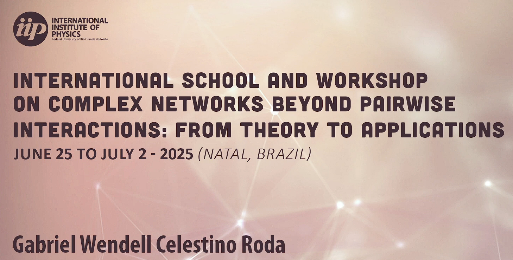
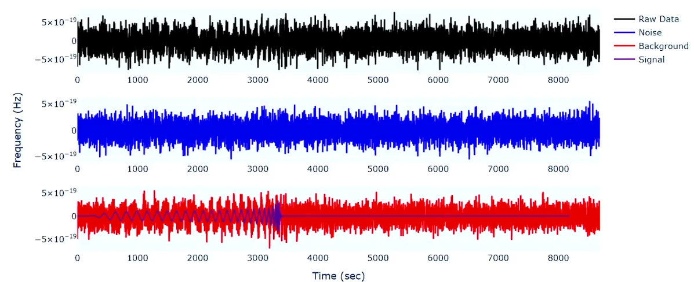

# 🌀 Topological Data Analysis for Gravitational-Wave Detection under Low SNR

- **Author:** Gabriel Wendell Celestino Rocha 
- **Affiliation:** Department of Physics, Federal University of Rio Grande do Norte (UFRN)  
- **Event:** 4th School on Data Science & Machine Learning (ICTP-SAIFR / IFT-UNESP, 2025)

---

## 📖 Overview

This repository contains the full implementation of the research project **"Topological Data Analysis for Gravitational-Wave Detection under Low Signal-to-Noise Ratios"**, developed for the *4th School on Data Science & Machine Learning (DSML 2025)*.


The project investigates how **Topological Data Analysis (TDA)** techniques can identify gravitational-wave-like signals embedded in strong noise. Using synthetic datasets, the workflow reconstructs the phase-space topology of signals and tracks persistent homological features (connected components and loops) as the signal-to-noise ratio (SNR) varies.

---

## 🧩 Repository Structure

```git
TDA-GW_Low_SNR-4th_DSML/
│
├── src/         # Source code (embedding, TDA, robustness, ML pipeline)
│ ├── embed/     # Time-delay embedding (AMI, FNN, Takens reconstruction)
│ ├── tda/       # Persistent homology and diagram generation
│ ├── baselines/ # Baseline feature computation (statistics, spectral)
│ ├── ml/        # Machine Learning pipeline (training, evaluation)
│ ├── robust/    # Sensitivity and ablation analysis
│ └── interpret/ # Feature interpretation and visualization
│
├── data/        # Input and processed data (synthetic, PI/PL/BC features)
├── results/     # Output persistence diagrams, plots, and tables
├── notebooks/   # Documentation notebooks (e.g., Phase2_TDA_Analysis.ipynb)
├── figures/     # Figures for poster and publication
│
├── LICENSE
├── README.md
└── requirements.txt
```

---


## 🚀 Execution Order

Below is the **recommended order** to reproduce the results end-to-end.

| Step                                   | Script / Module                                               | Description                                                        |
| -------------------------------------- | ------------------------------------------------------------- | ------------------------------------------------------------------ |
| **1. Synthetic Dataset Generation**    | `src/embed/run_embeddings.py`                                 | Generates Takens embeddings, estimates $\tau$ (AMI) and $m$ (FNN). |
| **2. Baseline Features**               | `src/baselines/run_baselines.py`                              | Computes statistical and spectral descriptors for comparison.      |
| **3. Persistence Diagrams**            | `src/tda/run_pd.py`                                           | Builds Vietoris–Rips complexes and computes PH $(H_0,H_1)$.        |
| **4. Vectorization**                   | `src/tda/run_vectorize.py`                                    | Converts persistence diagrams into PI, PL, and BC features.        |
| **5. Diagnostic Analysis**             | `src/tda/run_diagnostics.py` (or `Phase2_TDA_Analysis.ipynb`) | Analyzes feature stability and PD trends across SNRs.              |
| **6. ML Pipeline**                     | `src/ml/run_ml.py`                                            | Trains classifiers using PI/PL/BC features (LogReg, SVM, etc.).    |
| **7. Sensitivity Analysis**            | `src/robust/run_snr_sweep.py`                                 | Evaluates performance across different SNR thresholds.             |
| **8. Ablation Studies**                | `src/robust/run_ablation_embed.py`                            | Tests robustness under embedding parameter perturbations.          |
| **9. Computational Profiling**         | `src/robust/run_profile_compute.py`                           | Profiles runtime of embedding, PH, and vectorization stages.       |
| **10. Interpretation & Visualization** | `src/interpret/run_poster_figures.py`                         | Generates final poster figures and interpretability maps.          |

---

## 📘 Documentation Notebook

- **[`Phase2_TDA_Analysis.ipynb`](notebooks/Phase2_TDA_Analysis.ipynb)**  
  Documents the full topological feature extraction pipeline, including PD visualizations,  
  stability metrics, and vectorization results.

---

## 🧠 Methods Summary

- **Time-delay embedding:**  
  
  $
  \Phi(t) = \left[x(t), x(t - \tau), \dots, x(t - (m-1)\tau)\right]\text{ }.
  $

- **Vietoris–Rips filtration:**  
  
  $
  R_\epsilon(X) = \{ [v_0,\dots,v_k] : d(v_i,v_j) \leq \epsilon \}\text{ }.
  $

- **Persistence image (PI):**  
  
  $
  I(x, y) = \sum_i w_i \exp{\left[\frac{(x-b_i)^2 + (y-p_i)^2}{2\sigma^2}\right]}\text{ }.
  $

- **Classification metrics:**  
  AUC, Average Precision, F1-score, and Brier reliability score.

---

## 🧩 Key Results

- PI and PL achieve near-perfect separability for high SNR $(>8)$.  
- Topological signatures ($H_1$ loops) correlate with waveform periodicity.  
- Features are robust under $\pm10\%$ $\tau, m$ perturbations.  
- Computational cost dominated by persistence computation $[\thicksim\mathcal{O}(n^3)]$.  

Figures available in: [`results/poster/`](results/poster/)

---

## 🪞 Poster Reference

The results of this repository were presented at **“4th School on Data Science & Machine Learning (DSML 2025)”** as a poster titled:  

> **Topological Data Analysis for Gravitational-Wave Detection under Low SNR**

Poster and figures: [`results/poster/4th_School_DSML_2025_Poster.pdf`](https://github.com/GabrielWendell/TDA-GW_Low_SNR-4th_DSML/blob/main/results/poster/4th_School_DSML_2025_Poster.pdf)

You can also check out a 15-minute seminar I gave at IIP on the topic of [*Topological Data Analysis Applied to Complex Systems*](https://www.youtube.com/watch?v=KZo9ciaaBKI&list=PLqTLz9G2bGs2-ToEsAuUg3u6ZASY1UbAk&index=23&t=625s) for a more basic reference on the fundamentals of TDA.




---

## 📜 License

This project is licensed under the **MIT License** — see the [LICENSE](LICENSE) file for details.

---

## 🙌 Acknowledgments

Supported by the Pos-Graduation Program in Physics (UFRN).  
Special thanks to the DSML 2025 organizers.
